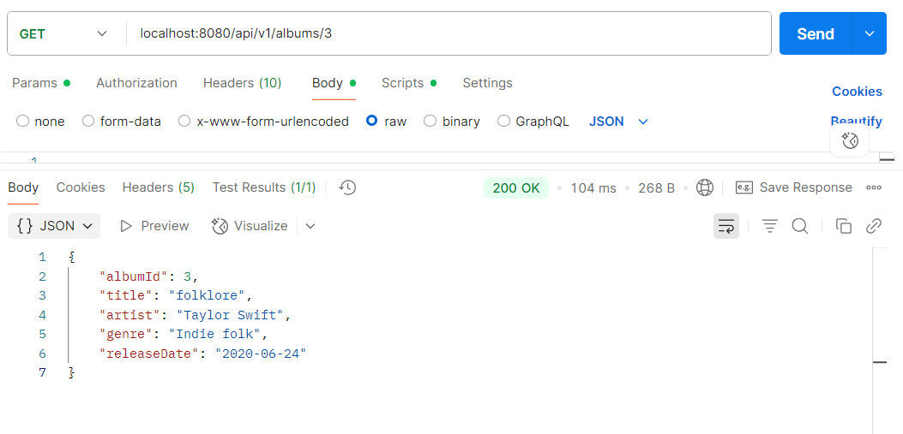

API REST ÁLBUMES MUSICALES USANDO SPRINT BOOT 
El proyecto tiene como tema álbumes musicales. Se creó la tabla album en la base de datos, con los siguientes atributos: albumId, title, artist, genre y releaseDate.

Se implementaron y probaron las operaciones GET, POST y PUT, verificando que las solicitudes al servidor funcionaran correctamente y que los datos se almacenaran, actualizaran y recuperaran según lo esperado.

1. Creación de un album
   
2. Mostrar todos los Albums
   
3. Obtener album por Id
   
4. Actualizar un album
   
5. Eliminar un album
     
 
